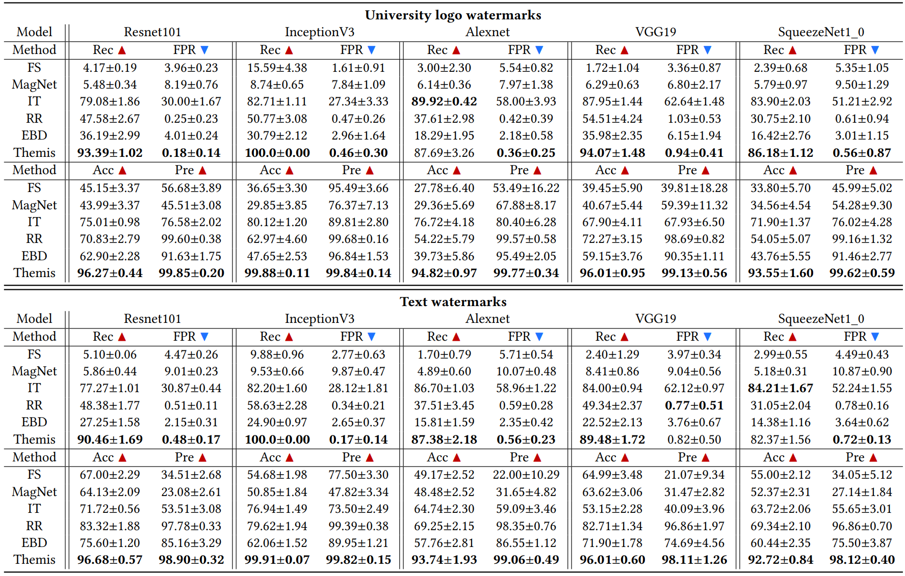

# ⚖️ Themis

## Requirements

```bash
pip install Pillow
pip install torch
pip install torchvision
```

## AEs \& non-AEs

The "aes" folder stores a series of watermark AEs based on the SqueezeNet1_0 classifier. 
The "non-aes" folder stores a series of unsuccessful instances of watermark attacks and clean samples. 

## Pre-trained models

The "model" folder stores a normal SqueezeNet1_0 model (pre-trained weights from the Torchvision library) and an auxiliary model upon the empty inputs, they will be used to calculate the usable information for AE detection. 

## How to use

Execute the following command:
```bash
python detect.py
```

## Evaluation

For AE generation, 15 different watermarks for perturbation.


The watermark AE instances for SqueezeNet1_0. For each sample, the black font corresponds to the ground-truth label of the original clean sample, and red font refers to the misclassification result of the watermark AE.


For different perturbation watermarks on ImageNet, we report the mean results (university/text, as supplementary material) and standard deviation for Recall, FPR, accuracy, and precision in Table.



We set respectively the maximum number of iterations $iter$ = \{0, 1, 2, 3\} for the attack process, where $iter$ = 0 refers to using only the 50 groups contained in the initial population without iterative optimization. 
The F1-score of detection results (corresponding to Alexnet and Resnet101 models) for five baselines and \sys (black marks) against three types of watermarks, as follows.


We fix the position exploration of the watermark perturbation (\ie $NP$ = 1, only use one group of $<$watermark transparency, X coordinate, Y coordinate$>$ settings per initialization randomly), and change the $scale$ = \{${1}/{4}$, ${1}/{3}$, ${1}/{2}$, ${2}/{3}$\}, to develop ablation experiments. 
For various $scale$ settings, we calculate the F1-score of \sys and five baselines, for five protected classifiers. 
The figure below displays the average results and standard deviation which adversaries using two types of watermarks (as supplementary material). 


By changing the drop rate, we plot the ROC curves of Themis and baselines against 15 types of logo watermarks.


